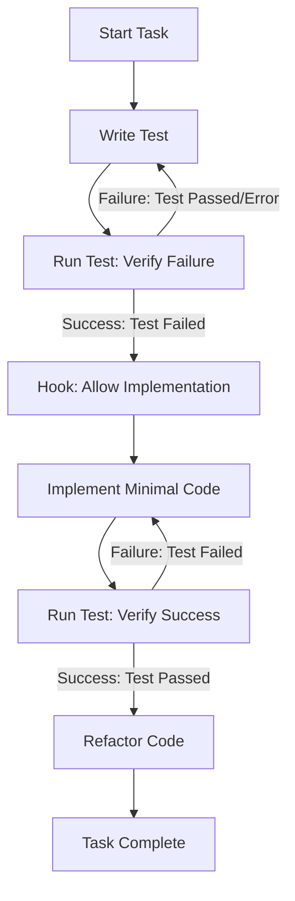

# opencoding-agent

opencoding-agent is an OpenCode plugin that provides specialized agents and a subagent management system.

## Features

- **Custom Agents**: Replaces default agents with specialized `plan` and `build` modes.
- **Subagent Catalog**: Browse and install subagents from the [awesome-opencode-subagents](https://github.com/j5hjun/awesome-opencode-subagents) repository.
- **TDD Enforcement**: Automatically blocks implementation work until tests are written and failed (Red phase).
- **Design Approval Guardrails**: Requires explicit user approval for implementation plans before code execution.
- **Tool Alias Correction**: Intelligently maps deprecated or incorrect tool calls to the correct plugin tools.
- **Toast Notifications**: Real-time feedback in the OpenCode UI for hook execution, system status, and agent transitions.

## Workflows

### TDD Cycle (Red -> Green -> Refactor)

The plugin enforces a strict TDD cycle through tool execution hooks.

1.  **Red Phase**: The agent must first write a test that fails. The `beforeToolExecution` hook monitors test results. If an agent tries to modify source code (`src/`) without a recorded failing test for the current task, the operation is blocked.
2.  **Green Phase**: Once a failing test is confirmed, the hook allows modifications to source files. The agent implements the minimal code required to pass the test.
3.  **Refactor Phase**: After the test passes, the agent can refactor the code. The hook ensures that any further changes still satisfy the existing test suite.



### Design Approval (Approval) Process

To prevent hallucinations and unauthorized actions, the plugin implements a formal approval gateway.

1.  **Plan Creation**: The agent analyzes the task and generates a detailed implementation plan.
2.  **Approval Request**: The agent presents the plan to the user and explicitly asks for approval.
3.  **Guardrail Check**: Any attempt to execute implementation tools (like `Edit` or `Write` on source files) before the user provides a "go-ahead" or "approved" signal will be intercepted and blocked by the plugin.
4.  **Execution**: Once approved, the agent proceeds to the TDD Cycle.

## Installation

Add this plugin to your `opencode.json`:

```json
{
  "plugin": [
    "opencoding-agent"
  ]
}
```

OpenCode automatically installs plugin dependencies at runtime.

## Tools

- `/subagent-catalog:list`: List available subagent categories.
- `/subagent-catalog:search <query>`: Search for specific subagents by name or description.
- `/subagent-catalog:fetch <name> [scope]`: Download and install a subagent (scope: `global` or `local`).

## Development

To install dependencies:

```bash
bun install
```

To build:

```bash
bun run build
```
